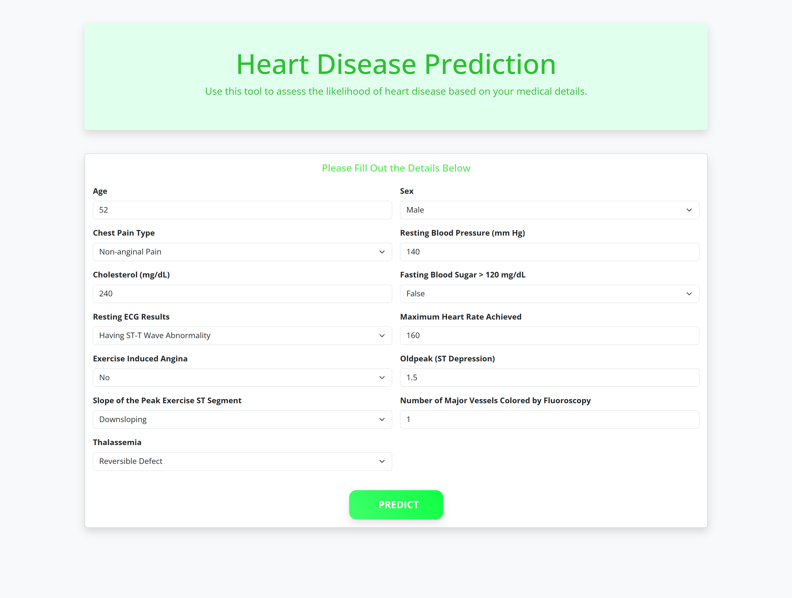
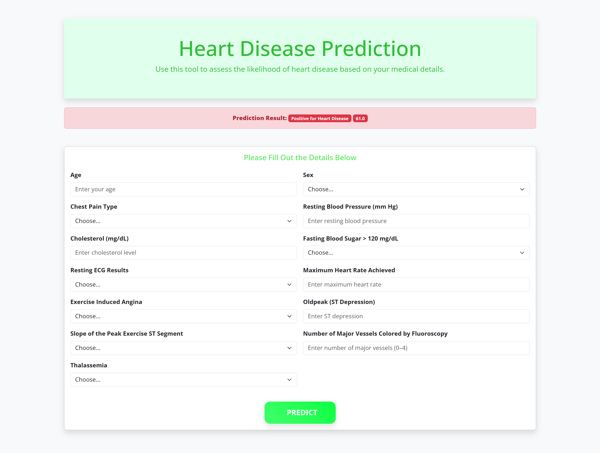

# **Heart Disease Detection Project**  

This project is a Flask-based web application designed to predict the likelihood of heart disease. It features a user-friendly interface where users can input various medical parameters (e.g., age, sex, chest pain type, blood pressure, cholesterol levels). The input data is processed through a trained machine learning model, which provides a prediction of whether the user is at risk for heart disease.  

---

## **Features**  
- Simple and intuitive web interface for inputting medical parameters.  
- Machine learning-based prediction using a **Random Forest Classifier**.  
- Outputs:  
   - **Positive for Heart Disease** or **Negative for Heart Disease**.  
   - Prediction probability for added transparency.  

---

## **Machine Learning Model**  

- **Model**: Random Forest Classifier  
- **Training Data**: A dataset containing heart disease records with 13 medical features.  
- **Output**: Binary prediction (Positive/Negative) with an associated probability score.  

---

## **Installation**  

1. Clone the repository:  
   ```bash
   git clone https://github.com/Oussama1403/Heart-Disease-Detection.git
   cd Heart-Disease-Detection
   ```  

2. Install the required dependencies:  
   ```bash
   pip install -r requirements.txt
   ```  

---

## **Usage**  

1. Navigate to the project directory and run the Flask application:  
   ```bash
   python flask_app.py
   ```  

2. Open your web browser and access the app at:  
   ```  
   http://127.0.0.1:5000  
   ```  

3. Input the required medical features into the web form and submit to get predictions.  

---

## **Screenshots**  
<div style="display: flex; gap: 10px;">
    
    
</div>

---

## **License**  
This project is licensed under the MIT License.  

---

## **Future Improvements**  
- Improve model performance with hyperparameter tuning.  
- Add visualizations to show user results (e.g., risk scores or charts).  
- Deploy the application online (e.g., using Heroku or AWS).  